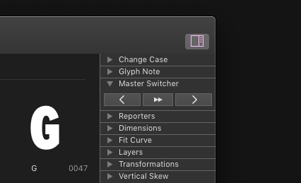

# MasterSwitcher

This is a [Glyphs.app](http://glyphsapp.com/) palette plug-in  for stepping through font masters. It is very useful if you have to juggle many masters, or need to repeat a task for each master.

Use the left button to step to the previous master, and the right button to step to the next master. Use the middle button for jumping half the masters. This is useful if one half of your masters is e.g. narrow or italic.

### Installation

1. One-click install *Master Switcher* from *Window > Plugin Manager*
2. Restart Glyphs.

### Usage Instructions

1. Open the Palette (Cmd-Opt-P).
2. Click on the buttons in the *Master Switcher* section.

### License

Copyright 2020 Rainer Erich Scheichelbauer (@mekkablue).
Based on sample code by Georg Seifert (@schriftgestalt) and Jan Gerner (@yanone).

Licensed under the Apache License, Version 2.0 (the "License");
you may not use this file except in compliance with the License.
You may obtain a copy of the License at

http://www.apache.org/licenses/LICENSE-2.0

See the License file included in this repository for further details.
